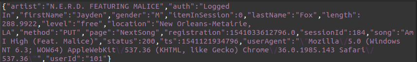

# etl-log

This is a project to consolidate the basics I've acquired in data engineering.
 There we have a bunch on files representing logs of a music streaming application server.
 We supposed that a business unit want to know the song the most listened 
 for every week of the year. We will build a pipeline with extract data 
 from the data source, transform it to match the business requirements
 and load it to a postgre database, the whole process scheduled with 
 Apache Airflow.
 
 
 ### Pipeline
 
 The data source is a directory with .json files, each represented logs registered for
 a day. There is the structure of the file: 
 
 
 
 We will first extract the data in a `pandas.DataFrame`. Filter the dataFrame
 by the `page` column to avoid to manage with connexions to the "home" or 
 "about" pages, then transform the  `ts` column which is the timestamp in 
 week of the year. After we will divide it in dataFrames which each 
 represents a `week_of_year`. In each dataFrame we will group by `song` and
 count the all the occurences of them. Then we select the song with the max.
 After all those steps we merge the dataFrames into one that we load in the
 postgresql database. 
 
 The ETL function been created, we schedule the pipeline to excecute all
 the beginning of week.
 

